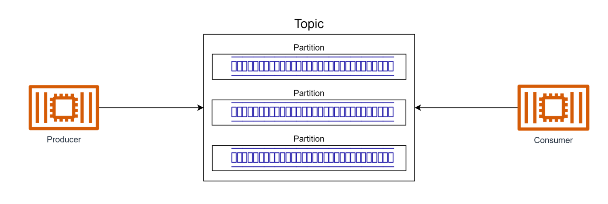
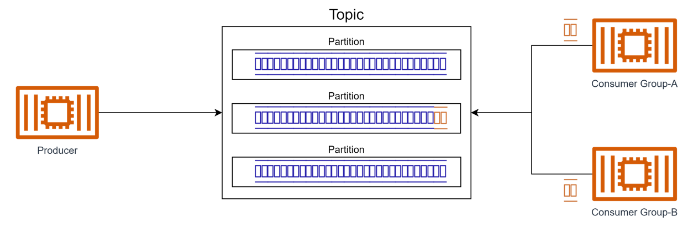
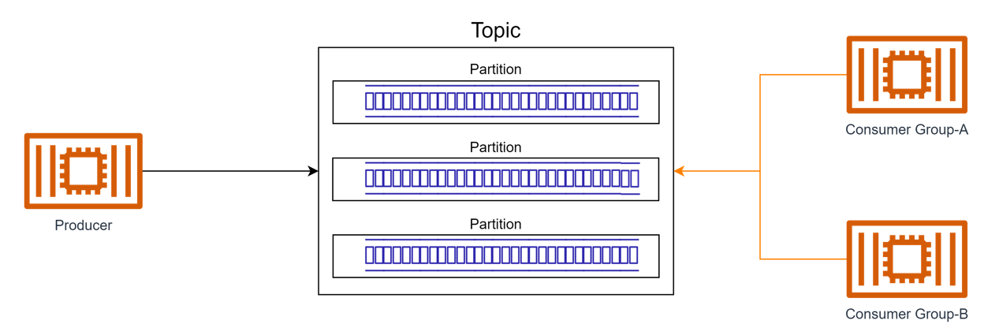
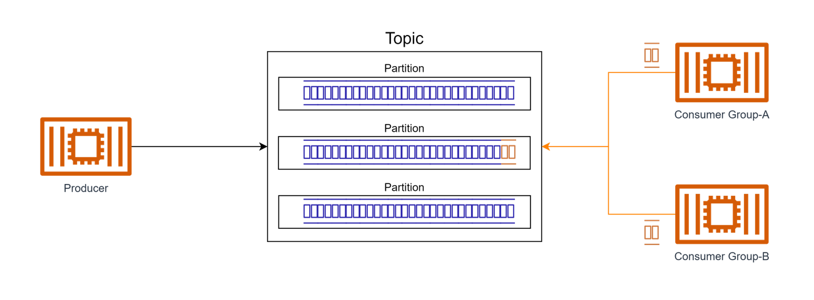
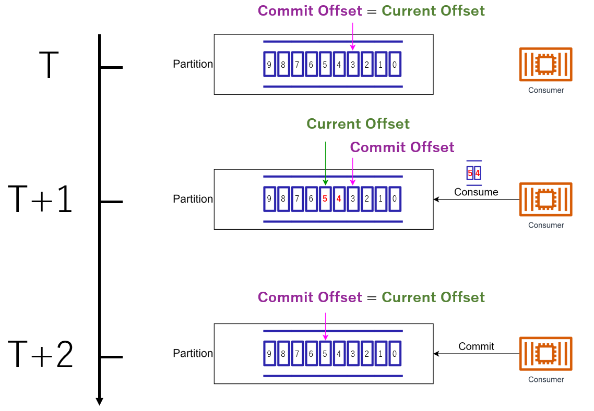
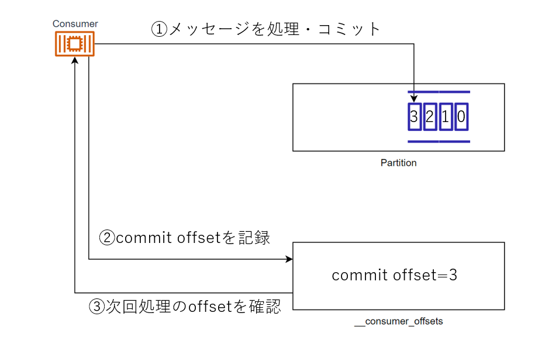
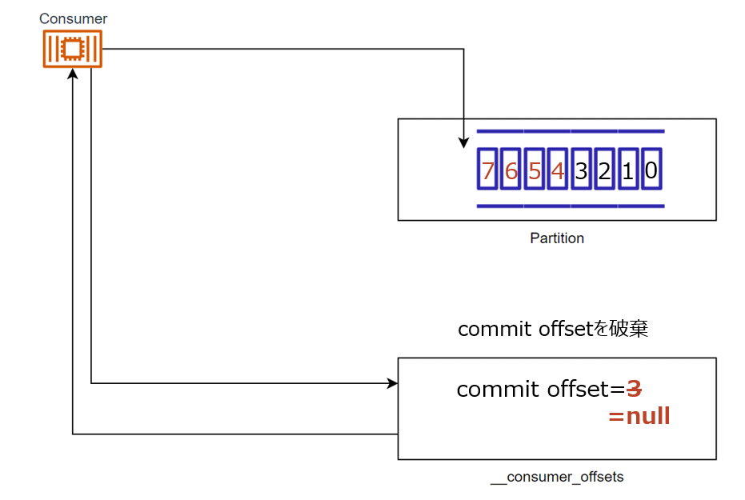
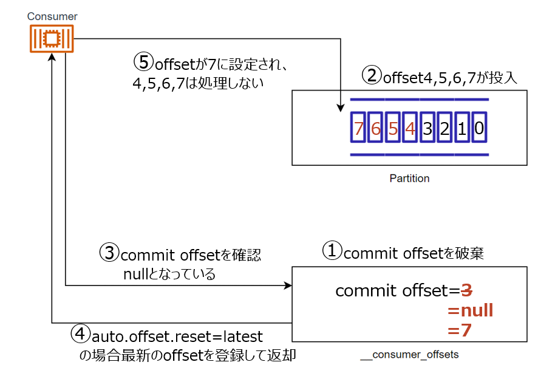
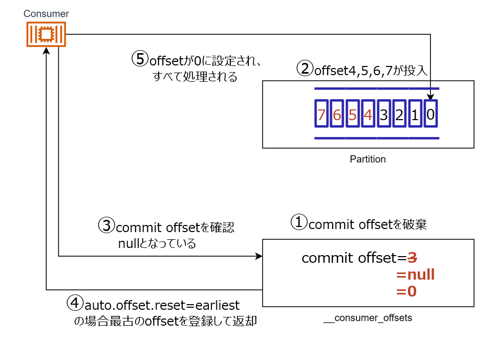

# MSK

  

---
## MSKの概要
----
### Topic/Partition

    

        生成されたメッセージはKafkaのTopicに送信される 
        Topicはpartitionと呼ばれる単位に分割され 
        partitionの中にデータが格納される。
    

  

---
## MSKの型
----
### ストリームデータ型

    

        ストリームデータは大規模かつ連続的に生成され、 
        リアルタイムかつ順序性を担保して処理されることで 
        価値を生むことが多い
    

  

----
### Pub-Sub

    

        Producerが生成したデータを 
        複数のConsumerが受信することができる

  

----
### Pull型

    

        データは一度kafkaに格納される 
        データの取得は、consumerが能動的に行う
    

  

----
### まとめ

    

        連続したリアルタイムデータであるストリームデータを扱い、 
        同じデータを複数のConsumerが受信可能なPub-Sub型であり、 
        Consumerが能動的にデータを取得するpull型のサービス
    

  

---
## Consumerグループ
----
### Pub-Subモデルの実現

    

        Pub-Subモデルを実現するために、Consumer側で所属するConsumer-Groupを定義する 
        Consumer-Group単位でメッセージを受信する
    

  

---
## offset
----
### ストリーム型データの扱い

    

        ストリーム型のデータの処理順序を担保するため 
        offsetと呼ばれるメッセージのインデックスが付与される 
        kafkaではpartition単位でoffsetが払い出される
    

  

----
### offsetの種類

    

        Log-End-Offset:partitionの末尾のメッセージの番号 
        Current-Offset:consumerが読み込んだメッセージの番号 
        commit-Offset:consumerがコミットしたメッセージの番号
    

  

----
### 正常処理時のoffset

    

        consumerはcommit-offsetを確認 
        後続メッセージを取得してcurrent-offsetを更新する 
        正常終了した場合はcommit-offsetを更新する
    

  

----
### 処理失敗時のoffset

    

        後続メッセージを取得して処理中に失敗した場合、 
        再起動した、consumerはcommit-offsetを再確認し、 
        その後続のメッセージを再度取得する
         
    

  

---
## offsetの管理
----
### __consumer_offsets

    

        各トピック、各consumer-gruoupごとのcommit-offsetが 
        __consumer_offsetsに書き込まれている 
    

  

----
### __consumer_offsetsの削除ポリシー

    

        consumerGroupが活動しない期間が長いと、__consumer_offsetsの情報を削除する 
        この期間はoffsets.retention.minutesで指定さている(デフォルト7日) 
        commit-offsetが削除された際の挙動はauto-offset-resetの定義次第
    

  

----
### auto-offset-reset:latest

    

        consumerが既存のoffsetを見つけられない場合どのメッセージから消費するかの設定 
        latest:最新のoffsetからメッセージを処理、新しく到着するメッセージのみを消費する 
        破棄されてから、Consumerが起動されるまでに投入されたデータは処理されない
    

  

----
### auto-offset-reset:earliest

    

        consumerが既存のoffsetを見つけられない場合どのメッセージから消費するかの設定 
        earliest:トピックの最初のメッセージから消費する 
        破棄されてから、consumerが起動すると、全ての処理が再実行される
    

  

----
### Lagについて

    

        Topic単位で未処理データ数をLog-End-Offsetとcommit-offsetの差の和をとった 
        sumoffsetlagというメトリクスで取得できる 
        sumoffsetlagは__consumer_offsetsを参照し算出するためconsumerが0台でも算出可能
    

  

